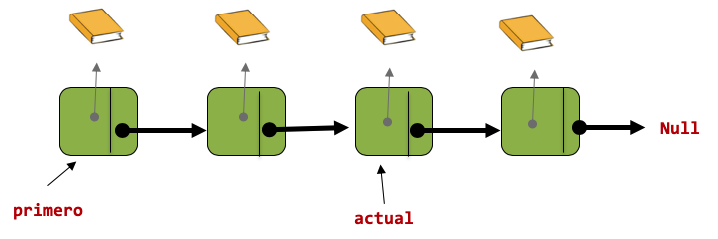

# Laboratorio #6 [Listas Enlazadas Libros]

En este ejemplo la lista  de punteros a libro.

- La relacion entre la colección y sus partes es de composición

- Las propiedades son definidas por los estudiantes

Se incluye los métodos nuevos:

- Insertarfinal
- Eliminarfinal
- Econtrado (recibe un id de libro lo busca y retorna true si lo encontró y false sino)
- ObtenerLibro (recibe un id de libro lo busca y lo retorna)
